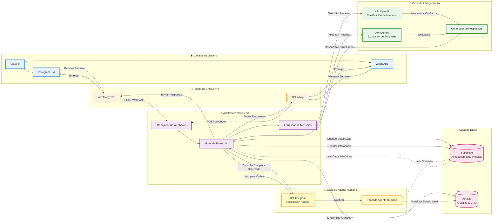

# ✈️ Agencia de viajes

> Breve resumen:
> Creación de un sistema conversacional ligero y orientado a la privacidad para una agencia de viajes con el fin de calificar y captar clientes potenciales para visitas guiadas por la ciudad y servicios de viaje. El bot se encargaba de la calificación inicial, capturaba la información de contacto y transfería los clientes potenciales a un agente humano para que les proporcionara presupuestos y realizara las reservas. Este README destaca el problema, la solución, los resultados y las lecciones aprendidas, y es adecuado para mostrarlo a los responsables de contratación o a las partes interesadas sin revelar los detalles de la implementación.

---

## 📄 Descripción general

Este proyecto es un MVP orientado a la producción que automatiza la parte frontal del embudo de ventas de una agencia de viajes: identifica la intención (visita guiada por la ciudad, seguro de viaje, otros), captura datos mínimos pero de gran valor (nombre, WhatsApp, destino, fechas, tamaño del grupo, interés principal) y deriva los clientes potenciales cualificados a un agente humano para que finalice los presupuestos y las reservas.

El sistema se construyó como una automatización compuesta: un chatfront (ManyChat), dos orquestadores de flujo de trabajo (n8n y make.com), almacenamiento/análisis ligeros (Supabase / Airtable) y componentes de IA (OpenAI y Gemini para tareas de NLU/asistente). Se probó con un breve impulso publicitario para validar las hipótesis y medir los primeros KPI.

> Estado: **No activo** por el momento: el repositorio contiene el resumen del proyecto y los artefactos (capturas de pantalla, diagramas de flujo). Se han omitido intencionadamente los detalles de implementación y las credenciales.

---

## 🎯 Los problemas

Las agencias de viajes suelen perder la mayor parte del tráfico entrante de la web y las redes sociales porque:

* Los visitantes no saben qué preguntar ni por dónde empezar en una ciudad nueva.
* La calificación manual (llamadas/mensajes directos) es lenta e inconsistente.
* Los anuncios y las campañas en redes sociales generan clics, pero no siempre contactos o números de teléfono cualificados.
* Las agencias necesitan una forma sencilla de convertir el interés en un cliente potencial de WhatsApp (donde se cierran la mayoría de las reservas), manteniendo al mismo tiempo al ser humano en el circuito para el precio final y los pagos.

Este proyecto tenía como objetivo demostrar un flujo conversacional automatizado sencillo que:

* Reducir el tiempo de respuesta,
* Capturar datos de contacto útiles y
* Aumentar el volumen de clientes potenciales listos para el seguimiento de ventas por parte de personas.

---

## 💡 Las soluciones

Un embudo conversacional ligero que:

1. **Identifica la intención** inmediatamente (visita a la ciudad, seguro, otros) y pide el nombre del visitante (microcompromiso).
2. **Revela las motivaciones principales** (por ejemplo, gastronomía, historia, aventura, vida nocturna) para que los clientes potenciales estén presegmentados para un seguimiento personalizado.
3. **Captura datos mínimos de reserva** (WhatsApp, destino, fecha, número de personas) para que un agente humano pueda enviar un presupuesto preciso y finalizar la reserva en WhatsApp.
4. **Pasa el testigo** a un humano cuando se requiere precio/complejidad o cuando se agotan los reintentos.

Esto mantuvo la automatización centrada en la calificación y el traspaso, maximizando la seguridad (sin pagos, sin automatización de confirmaciones legales) y mejorando al mismo tiempo el rendimiento de los clientes potenciales.

---

## 🛠️ Herramientas utilizadas

Pila de alto nivel (no se incluyen aquí instrucciones paso a paso):

* **ManyChat**: interfaz de chat específica para Instagram (flujos de mensajería web/social y respuestas rápidas).
* **Webhooks**: receptor y editor de flujos de trabajo (conexión, enrutamiento, transferencia, activadores).
* **make.com**: coordinación de flujos de trabajo (enrutamiento, validaciones, activadores de enriquecimiento).
* **n8n**: orquestación de flujos de trabajo (enrutamiento, validaciones, activadores de enriquecimiento).
* **Supabase**: almacén de clientes potenciales sin procesar/base de datos (almacenamiento, datos transaccionales).
* **Airtable**: paneles de análisis e informes para la agencia.
* **API de OpenAI**: comprensión del lenguaje natural y mensajes del asistente (utilizados para la normalización de intenciones/espacios y el pulido de conversaciones).
* **Gemini API**: comprensión del lenguaje natural y avisos del asistente (utilizados para la normalización de intenciones/espacios y el pulido de conversaciones).
* **Telegram**: notificaciones internas/alertas de operaciones.

---

## 📸 Demostración/flujo de trabajo

### 1. Arquitectura del sistema
> El siguiente diagrama ilustra el flujo de datos desde el contacto inicial del usuario hasta el almacenamiento final del cliente potencial. Destaca cómo la capa de orquestación (n8n/Make) actúa como middleware entre la interfaz de chat frontend (ManyChat) y las capas de lógica/almacenamiento (OpenAI, Supabase).

#### 1.1 Lógica de conversación (flujo de usuarios)

🔎 Haga clic para ver el árbol de decisiones de conversación detallado

Nota: En los archivos del repositorio se puede consultar una versión depurada del esquema del flujo de trabajo (Appointment Assistant.blueprint.json).

### 2. La lógica de automatización (Make)

### 3. Los flujos de mensajería (Manychat)

---

## 📈 Resultados (prueba de pago de 3 días y pruebas manuales iniciales)

Cifras de la primera y única prueba breve (campaña publicitaria de tres días + pruebas orgánicas). Son aproximadas y se presentan tal y como se observaron durante la prueba:

* **Gasto publicitario:** 10 $ (3 días)
* **Total de interacciones gestionadas (aproximadamente):** ~45
* **Respuestas automáticas inmediatas por chatbot:** 23
* **Total de clientes potenciales registrados:** 24
* **Clientes potenciales de WhatsApp orgánicos (directos no pagados):** 3
* **Clientes potenciales de anuncios pagados (aproximadamente):** 20
* **Coste por cliente potencial (CPL) de los anuncios pagados:** 10 $ / 20 = **0,50 $ / cliente potencial**
* **Ventas / conversiones registradas durante esta prueba:** 2

**Interpretación:** el experimento validó la eficiencia de la adquisición (CPL muy bajo) y que el bot puede gestionar la calificación inmediata a gran escala. El proceso de seguimiento y el flujo de pago requieren una mayor optimización.

---
---

## 🔍 Conclusiones y lo que funcionó

* **Primer contacto sin fricciones:** pedir el nombre y la intención desde el principio aumenta el microcompromiso y reduce el abandono.
* **Enrutamiento basado en la motivación:** captar el interés principal del cliente potencial (por ejemplo, gastronomía frente a historia) permite realizar seguimientos muy relevantes y una mejor segmentación para los agentes humanos.
* **Adquisición pagada rentable:** un pequeño gasto en publicidad generó un número significativo de clientes potenciales con un CPL muy bajo.
* **Modelo de traspaso:** la combinación de bot + traspaso humano evita el riesgo de automatización excesiva y preserva la calidad de la conversión.

---

## ⚠️ Lo que mejoraría (próxima iteración)

El MVP demostró la viabilidad del concepto, pero puso de relieve varias áreas de mejora para aumentar la conversión en reservas de pago:

* **Embudo de reservas más sólido en WhatsApp:** optimizar el flujo de presupuesto→pago→confirmación (integraciones de pago, confirmaciones de reserva).
* **Plantillas de seguimiento más rápidas y completas:** plantillas de WhatsApp predefinidas adaptadas a «main_concern» para acortar el tiempo de respuesta al presupuesto.
* **Puntuación de calificación:** añadir puntuación de clientes potenciales para que los agentes den prioridad a los prospectos más prometedores.
* **Pruebas A/B de copias y CTA:** probar variaciones de la pregunta «preocupación principal» y la solicitud de datos mínimos para optimizar la captura de datos frente a la fricción.
* **Flujos de reenganche:** recordatorios automáticos para clientes potenciales con datos incompletos.

---

## 📚 Lecciones aprendidas

* Los microcompromisos (nombre + intención) aumentan significativamente el compromiso.
* La segmentación por motivación principal permite presupuestos más personalizados y ventas adicionales más relevantes.
* Los experimentos en fase inicial se benefician de pequeños gastos publicitarios para validar rápidamente la economía unitaria.
* La captura de un número de teléfono es la variable más importante para la conversión posterior a través de WhatsApp.

---

## 📬 Contacto

--Gabriel Elias Flores--
Linkedin: https://www.linkedin.com/in/gabriel-elias-flores-440413342
Correo electrónico: gabrielias28e@gmail.com

---
