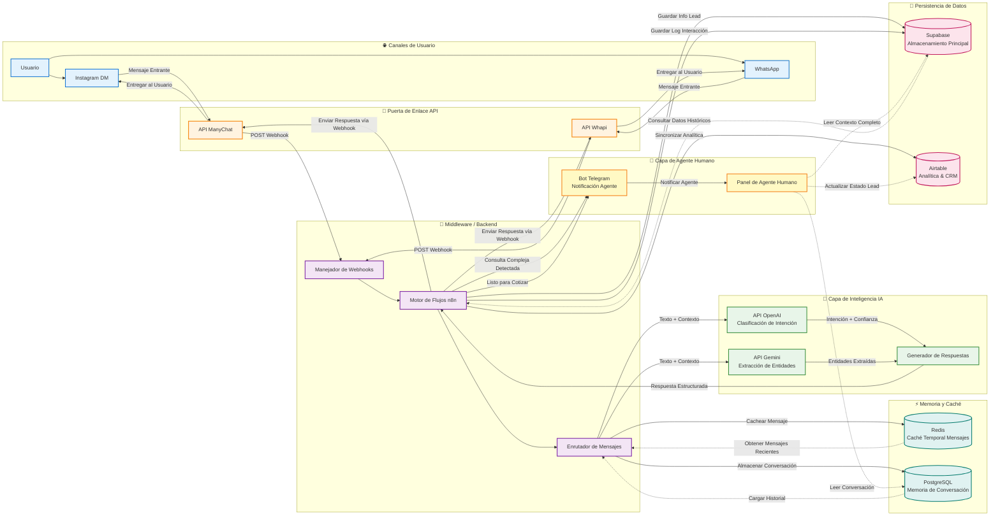

# 🏥 Secretaria médica con IA

## 📄 Descripción general

Un asistente virtual y un sistema de programación basados en WhatsApp, listos para su uso, creados para una consulta privada. Diseñados para reducir la carga administrativa de una consulta médica mediante la automatización de la reserva de citas, la recopilación de datos y la clasificación básica, al tiempo que se derivan los casos delicados o excepcionales a personas.

Cliente: **Dr. Marco S.**
Estado: **Implementado y en funcionamiento** (lanzamiento inicial en el mundo real, conversaciones en vivo procesadas).

---

## 🎯 El problema

Los médicos y las clínicas pierden tiempo en tareas administrativas repetitivas que se acumulan a lo largo del día:

* Reservas manuales y actualizaciones del calendario.
* Escribir los datos de los pacientes y las notas después de las consultas.
* Recepción de recibos de pago a través del chat sin un proceso de verificación fiable.
* Agotamiento causado por compaginar la atención al paciente con el trabajo administrativo.

Esto provoca retrasos, errores y una mala experiencia para el paciente.

---

## 💡 La solución 

Un flujo de trabajo automatizado que:

1. **Gestiona completamente el contacto inicial con el paciente** a través de WhatsApp (saludo, clasificación de intenciones, triaje simple).
2. **Ofrece y confirma citas** conectándose al calendario del médico y creando eventos.
3. **Recopila los datos de admisión** (formulario previo a la consulta) y los almacena en una base de datos centralizada para que los revise el médico.
4. **Deriva los casos excepcionales (pagos, llegadas el mismo día, «ya estoy aquí»)** a un canal humano (Chatwoot) para su confirmación manual.
5. **Proporciona un traspaso claro** al personal de la clínica cuando se requiere atención humana, evitando errores de automatización en situaciones urgentes o ambiguas.

El sistema se diseñó intencionadamente con reglas de decisión conservadoras: no autoriza automáticamente los pagos ni toma decisiones clínicas, sino que recopila, clasifica y reenvía.

---

## 🛠️ Herramientas y componentes (alto nivel)

* **n8n**: coordinación y transformaciones del flujo de trabajo
* **API de OpenAI** (Whisper y GPT): PLN para la comprensión de mensajes y la transcripción de audio
* **Airtable / Google Sheets / Supabase**: almacenamiento estructurado para la recepción y los registros, y creación de bases de datos al mismo tiempo
* **API de Evolution / ManyChat**: pasarela de WhatsApp (BSP / agente)
* **Chatwoot**: bandeja de entrada para traspasos humanos y asistencia
* **Google Calendar / Google Docs**: fuente de información veraz sobre citas y documentos con plantillas
* **Make.com (opcional)**: coordinación alternativa cuando sea necesario

> Nota: Este README se centra en los resultados y la arquitectura; no se incluyen la implementación detallada ni los scripts para proteger la propiedad intelectual.

---

## 🧭 Arquitectura de alto nivel

WhatsApp (paciente) → WhatsApp BSP (Evolution / ManyChat) → Capa NLP/HTTPS/WEBHOOKS (extracción de intenciones + entidades) → orquestación (n8n) → almacenamiento (Airtable/Sheets/Supabase) → escrituras en el calendario (Google Calendar) → Chatwoot (transferencia humana y supervisión)

(OpenAI/Gemini se utiliza para la interpretación de mensajes y la transcripción opcional de audio y la interpretación de imágenes).

---

## 📸 Demostración/flujo de trabajo

### 1. Arquitectura del sistema
> El siguiente diagrama ilustra el flujo de datos desde el contacto inicial del usuario hasta el almacenamiento final del cliente potencial. Destaca cómo la capa de orquestación (n8n) actúa como middleware entre la interfaz de chat frontend (Evolution API) y las capas de lógica/almacenamiento (OpenAI, Gemini, Supabase, Redis, Postgres).

#### 1.1 Lógica de conversación (flujo de usuarios)

🔎 Haga clic para ver el árbol de decisiones de conversación detallado

### 2. La lógica de automatización (n8n)

Nota: En los archivos del repositorio se puede consultar una versión depurada del esquema del flujo de trabajo (Appointment Assistant.blueprint.json).

### 3. Experiencia del paciente (WhatsApp)

### 4. Vista del administrador (transferencia de Chatwoot)

---

## 🔧 Problemas encontrados y soluciones

**Problema:** El paciente envió el recibo de pago y solicitó una cita para el mismo día cinco minutos antes de la hora programada. El bot intentó seguir el flujo normal de reservas y rechazó por error la disponibilidad para el mismo día, lo que generó fricciones. El paciente reaccionó negativamente.

**Causas fundamentales:**

* La secretaria/clínica derivó un caso urgente y sensible al tiempo a un canal que aún no estaba configurado para excepciones urgentes.
* El bot carecía de un detector robusto para las entradas «ya programado/en la clínica/prueba de pago».

**Soluciones inmediatas implementadas:**

1. **Gestión de pagos/recibos:** ahora el bot reconoce los recibos y los reenvía al personal para su verificación manual. El bot no da por sentada la validez del pago.
2. **Lógica del mismo día:** El bot ya no rechaza automáticamente las solicitudes a corto plazo, sino que las remite a un humano para su confirmación.
3. **Detector de «ya aquí»:** Las palabras clave activan una notificación humana inmediata y un breve reconocimiento empático al paciente.
4. **Memoria de franjas horarias:** si se acepta una hora sugerida, el asistente la almacena como la franja horaria propuesta confirmada y evita volver a preguntar.

---

## 📚 Lecciones aprendidas

* Los pacientes y el personal reales presentan casos extremos que no aparecen en las pruebas sintéticas. Hay que esperarlos y diseñar un sistema para escalarlos con elegancia.
* El patrón «human-in-the-loop» es esencial para los pagos, las emergencias y las excepciones administrativas.
* La comunicación y la alineación de los procesos con el personal de la clínica (especialmente los recepcionistas) es tan importante como la solidez técnica. Forme al personal de la clínica sobre qué canalizar al bot y qué canalizar a los canales humanos.
* Implante el sistema de forma conservadora: realice pruebas internas, luego pruebas externas limitadas y, por último, ábralo a pacientes reales.

---

## 📬 Contacto

--Gabriel Elias Flores--
Linkedin: https://www.linkedin.com/in/gabriel-elias-flores-440413342
Email: gabrielias28e@gmail.com

---
